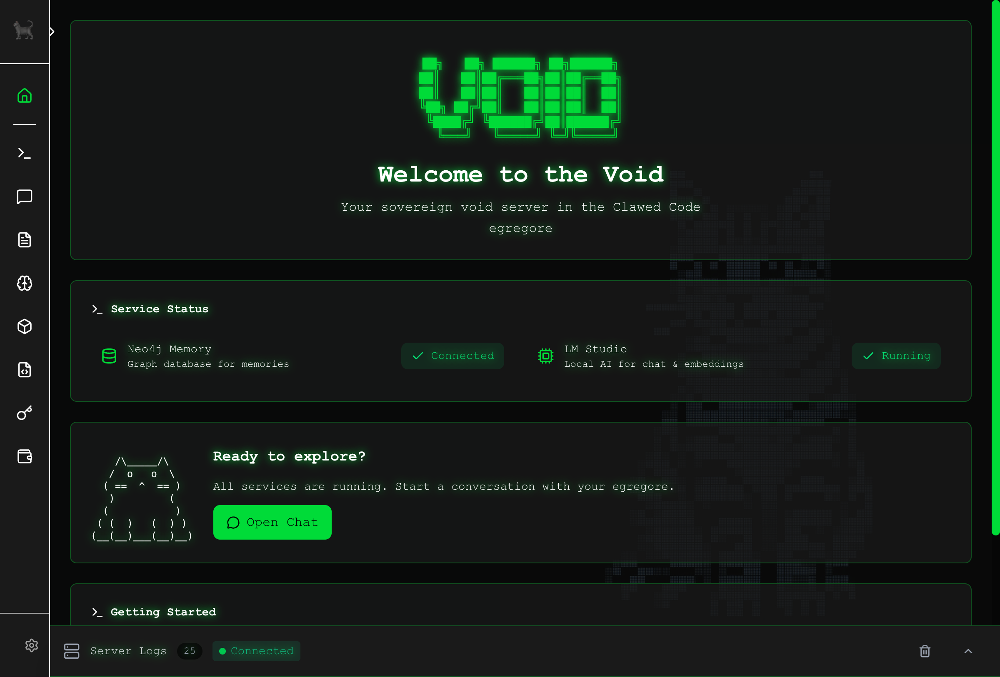

# Void Server

A modular, plugin-based creative platform for building and running your own sovereign tools. Extend it with plugins, customize it to your workflow, and engage with the void.



## Quick Start

### 1. Install Prerequisites

| Tool | Purpose | Install |
|------|---------|---------|
| [Node.js 20+](https://nodejs.org/) | Run void-server | Required |
| [Docker Desktop](https://www.docker.com/products/docker-desktop/) | Run Neo4j + IPFS | Required |
| [LM Studio](https://lmstudio.ai/) | GPU-accelerated local AI | Optional* |
| [Tailscale](https://tailscale.com/download) | Access from phone/anywhere | Optional |

*LM Studio is optional but recommended for GPU inference. If using LM Studio, download an embedding model (e.g., `nomic-embed-text`) and a chat model, then start the local server. Ollama can also run in Docker as an alternative.

### 2. Run

```bash
git clone https://github.com/ClawedCode/void-server.git
cd void-server
./setup.sh    # Installs deps, starts Docker infra, starts void-server with PM2
```

The setup script:
- Installs Node.js dependencies
- Starts infrastructure (Neo4j, IPFS, Ollama) via Docker
- Starts void-server natively with PM2

### 3. Access

- **Local:** http://localhost:4420
- **Remote:** `http://<tailscale-ip>:4420` (if Tailscale installed)

**Manage services:**
```bash
npm run status        # Check PM2 process status
npm run logs          # View server logs
npm run restart       # Restart void-server
npm run infra         # Start Docker infrastructure
npm run infra:down    # Stop Docker infrastructure
```

---

## Deploy Your Own Node

Deploy a lightweight federation bootstrap node to help the void-server network:

[](https://render.com/deploy?repo=https://github.com/ClawedCode/void-server)

Bootstrap nodes are lightweight (~50MB) and run on Render's free tier. They help peers discover each other via DHT routing without storing any data.

See [docs/FEDERATION.md](docs/FEDERATION.md) for full federation documentation.

---

## Configuration

### Environment Variables

Customize your deployment with environment variables (`.env` file supported):

Create a `.env` file to customize settings:

```bash
# Example .env file
NEO4J_PASSWORD=mysecurepassword
LM_STUDIO_URL=http://localhost:1234/v1
```

| Variable | Default | Description |
|----------|---------|-------------|
| `PORT` | `4420` | Server port |
| `NEO4J_URI` | `bolt://localhost:7687` | Neo4j connection URI |
| `NEO4J_USER` | `neo4j` | Neo4j username |
| `NEO4J_PASSWORD` | `voidserver` | Neo4j database password |
| `IPFS_API_URL` | `http://localhost:5001` | IPFS API endpoint |
| `IPFS_GATEWAY_URL` | `http://localhost:8080` | IPFS gateway URL |
| `OLLAMA_URL` | `http://localhost:11434/v1` | Ollama API endpoint |
| `LM_STUDIO_URL` | `http://localhost:1234/v1` | LM Studio API endpoint |
| `EMBEDDING_PROVIDER` | `auto` | Embedding provider (`ollama`, `lmstudio`, `auto`) |

### Persistent Data

All user data is stored in `./data/` for simple backup and migration:

| Directory | Purpose |
|-----------|---------|
| `data/chats/` | Chat history and turn logs |
| `data/browsers/` | Browser profiles for plugins |
| `data/prompts/` | Templates and variables |
| `data/wallets/` | Wallet plugin data |
| `data/models/` | Ollama models (if using Docker Ollama) |

See [docs/DATA.md](docs/DATA.md) for the complete directory structure.

### Remote Access

Access your Void Server from your phone or anywhere using [Tailscale](https://tailscale.com/):

1. Install Tailscale on your server and phone
2. Sign in with the same account
3. Access via Tailscale IP: `http://100.x.y.z:4420`

See [docs/REMOTE-ACCESS.md](docs/REMOTE-ACCESS.md) for detailed setup instructions.

## Features

- **Plugin System** - Install, enable/disable, and configure plugins via UI or CLI
- **Git Submodule Support** - Manage plugins as git submodules for reproducible builds
- **Real-time Logs** - WebSocket-powered server log viewer in the browser
- **Dynamic Navigation** - Automatically builds nav from installed plugins
- **Security Hooks** - Pre-commit scanning for secrets

## Documentation

| Guide | Description |
|-------|-------------|
| [Contributing](CONTRIBUTING.md) | How to contribute, PR process |
| [Style Guide](docs/STYLE-GUIDE.md) | Code conventions, logging format, icons |
| [Plugin Development](docs/PLUGINS.md) | Plugin structure, manifest, data storage |
| [Theme System](docs/THEME.md) | CSS variables, Tailwind classes, styling |
| [Data Directory](docs/DATA.md) | User data storage, plugin data conventions |
| [Chat System](docs/CHAT.md) | AI chat configuration and usage |
| [Memories](docs/MEMORIES.md) | Neo4j memory system and knowledge graph |
| [Remote Access](docs/REMOTE-ACCESS.md) | Tailscale setup for mobile/remote access |
| [HTTP Client](docs/HTTP-CLIENT.md) | Server-side HTTP request utilities |

## Commands

### Service Management

```bash
npm start            # Start services with PM2
npm run stop         # Stop services
npm run restart      # Restart services
npm run logs         # View logs (Ctrl+C to exit)
npm run status       # Check status
```

PM2 watches for file changes in `server/` and `plugins/` directories, automatically restarting the server when you edit code. The client uses Vite's built-in HMR for instant updates.

### Plugin Management

```bash
npm run plugin:status              # Show installed plugins
npm run plugin:add <git-url>       # Install plugin from git
npm run plugin:remove <name>       # Uninstall plugin
npm run plugin:update -- --all     # Update all plugins
```

## Plugin Development

**Zero-config plugin system** - add a plugin and restart, no core code changes needed.

```bash
# Add plugin, restart, done
git submodule add https://github.com/org/void-plugin-example.git plugins/void-plugin-example
npm run restart
```

See [docs/PLUGINS.md](docs/PLUGINS.md) for complete plugin development guide including manifest format, client/server structure, and data storage.

### Development Mode (Symlinks)

For local development, symlink plugins to sibling repos:

```bash
./scripts/plugin-dev-setup.sh
```

### Production Mode (Submodules)

For deployment, install plugins as git submodules:

```bash
npm run plugin:add https://github.com/org/void-plugin-example.git
```

## Architecture

Void Server uses a hybrid architecture: the application runs natively with PM2 while infrastructure services run in Docker.

```
       [ Phone ]             [ Computer ]
           │                      │
           └──────────┬───────────┘
                      │
              ┌───────┴───────┐
              │ Tailscale VPN │
              │ 100.x.y.z:4420│
              └───────┬───────┘
                      │
              (or localhost:4420)
                      │
                      ▼
┌───────────────────────────────────────────────────────────┐
│                  HOST MACHINE (NATIVE)                    │
│                                                           │
│  ┌─────────────────────────────────────────────────────┐  │
│  │               void-server (PM2) :4420               │  │
│  │  ┌─────────┐   ┌─────────┐   ┌─────────┐   ┌───────┐│  │
│  │  │ Express │   │  React  │   │ Plugins │   │ WS    ││  │
│  │  │   API   │   │  Client │   │ System  │   │ Logs  ││  │
│  │  └────┬────┘   └─────────┘   └─────────┘   └───────┘│  │
│  │       │                                             │  │
│  │       ├── Chat Svc ──┬── Memory Svc ──┬── Browser   │  │
│  │       │              │       │        │    Manager  │  │
│  │       ▼              ▼       │        │       │     │  │
│  │  ┌─────────┐   ┌──────────┐  │        │       │     │  │
│  │  │  IPFS   │   │Embeddings│  │        │       │     │  │
│  │  │ Service │   │  (LLM)   │  │        │       │     │  │
│  │  └────┬────┘   └────┬─────┘  │        │       │     │  │
│  └───────┼─────────────┼────────┼────────┼───────┼─────┘  │
│          │             │        │        │       │        │
│          │             │        │        │       ▼        │
│          │             │        │      ┌────────────────┐ │
│          │             │        │      │ Native Chrome  │ │
│          │             │        │      │ Instances (OS) │ │
│          │             │        │      │ :6081, :6082   │ │
│          │             │        │      └────────────────┘ │
│          │             │        │       (Playwright/CDP)  │
│          │             │        │                         │
│          │             │        │      ┌────────────────┐ │
│          │             │        │      │ LM Studio :1234│ │
│          │             └────────┼─────▶│ (GPU Models)   │ │
│          │                      │      └────────────────┘ │
│          │                      │                         │
└──────────┼──────────────────────┼─────────────────────────┘
           │                      │
           ▼                      ▼ 
┌──────────────────────────────────────────────────────────────────────────────┐
│                    DOCKER INFRASTRUCTURE (docker-compose)                    │
│                                                                              │
│  ┌──────────────────┐   ┌──────────────────┐   ┌──────────────────────────┐  │
│  │  ipfs (:5001)    │   │  neo4j (:7687)   │   │  ollama (:11434)         │  │
│  │ ┌──────────────┐ │   │ ┌──────────────┐ │   │ ┌──────────────────────┐ │  │
│  │ │  Kubo Node   │ │   │ │Graph Database│ │   │ │   Local AI Models    │ │  │
│  │ │  + Gateway   │ │   │ │  (Memories)  │ │   │ │ (Chat + Embeddings)  │ │  │
│  │ │  (:8080)     │ │   │ ├──────────────┤ │   │ └──────────────────────┘ │  │
│  │ └──────────────┘ │   │ │Browser :7474 │ │   │    data/models vol       │  │
│  │  ipfs_data vol   │   │ └──────────────┘ │   └──────────────────────────┘  │
│  └──────────────────┘   │  neo4j_data vol  │                                 │
│                         └──────────────────┘                                 │
└──────────────────────────────────────────────────────────────────────────────┘
```

### Port Reference

| Service | Port | Purpose |
|---------|------|---------|
| Void Server | 4420 | Main application (Express + React) |
| Neo4j Browser | 7474 | Database admin UI |
| Neo4j Bolt | 7687 | Database connection |
| IPFS API | 5001 | IPFS node API |
| IPFS Gateway | 8080 | Content gateway |
| Ollama | 11434 | Local AI inference (optional) |
| LM Studio | 1234 | GPU AI inference (optional) |
| Browser CDP | 6080+ | Chrome DevTools Protocol ports |

### Data Flow

1. **Chat** → User message → Prompt template + Memory context → LM Studio/Ollama → Response
2. **Memory** → Extract entities → Generate embeddings → Store in Neo4j graph
3. **IPFS** → Pin content locally → Announce to DHT → Retrieve via gateway
4. **Browser** → Plugin requests authenticated session → Connect to Chrome via CDP → Playwright automation

## Project Structure

```
void-server/
├── client/                 # React frontend (Vite + Tailwind)
├── server/
│   ├── index.js           # Express server + API
│   └── plugins.js         # Plugin management module
├── plugins/
│   ├── manifest.json      # Available plugins catalog
│   └── void-plugin-*/     # Installed plugins
├── scripts/               # CLI utilities
├── data/                  # User data & configuration (v0.8.0+)
├── docs/                  # Documentation
└── setup.sh               # One-command setup
```

## License

MIT
